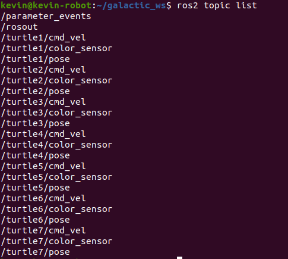

## 项目简介
本项目实现了对turtlesim中turtle的控制。这个项目主要用于实践ROS2养成计划课程内容。目前有直线行走一定距离，原地旋转一定角度等控制模式。如果大家有实现一些自己的功能可以提PR，以丰富该项目。并且也可以在课程上与大家分享演示。

## 运行方法
### 启动turtlesim
```
ros2 run turtlesim turtlesim_node
```
这时会弹出一个框，里面有一只乌龟，乌龟默认名称是turtle1。写代码的时候会用到这个名称。
可以用下面的命令再生成一只乌龟，名称会是turtle2. 生成的乌龟名字是按顺序命名的。
```
ros2 service call /spawn turtlesim/srv/Spawn "x: 5.0
y: 5.0
theta: 0.0
name: ''"
```
<p align = "left">

</p>
### 运行控制器
新打开一个命令窗口。运行下面的命令。
```
ros2 run turtlesim_controller turtlesim_controller_node
```
新打开一个命令窗口。运行下面的命令切换乌龟行走模式。  
向前行走两米
```
ros2 run turtlesim_controller turtlesim_controller_client 1
```
左转90度
```
ros2 run turtlesim_controller turtlesim_controller_client 2
```